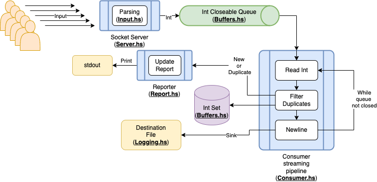

# generic-system-challenge

## Code Challenge

Hi! I hope this finds you well! This is my proposed solution to a code challenge, whose briefing can be read [here](CHALLENGE_BRIEFING.md). Here I will explain what was done to address it with a general architecture. There's also HTML documentation generated automatically, which discusses the functions from each module, as well as some improvement points, please feel free to visit it at [`doc/index.html`](doc/index.html)! (would have done it with GitHub pages, but the repo is private).

## How to run the application

There's a GitHub Actions pipeline that generates binaries for Windows, macOS and Linux (x86). Please head to the [Releases](https://github.com/DavSanchez/generic-system-challenge/releases) section and download the latest version.

### Optional: building from source

To build from source you need to have Haskell installed on your system. The recommended way to achieve this is through `ghcup`. Please go to <https://www.haskell.org/ghcup/> and follow instructions there. At a minimum, you should have the GHC compiler (this project uses GHC v8.10.7) and the Cabal tool.

Clone this repository, `cd` to it, and perform `cabal build`, `cabal test` or run the program directly with `cabal run generic-system-challenge`, depending on what you want to achieve.

## General architecture

This is a multi-threaded application that involves several components that use shared resources. A general overview of the system architecture can be found at the below diagram:

### Server

This can be considered the main component. A TCP **Server** that accepts up to 5 connected clients and accepts certain input bytestrings: a number in the interval `[0,999999999]`, padded with `0`s to the left until there are nine characters in total, or the `terminate` sequence, each of them followed by a native newline. The amount of connections, as the signal of server termination, is tracked via transactional variables.

### Input

This server parses the received **Input** using parser combinators, generating values appropriate for processing and acting accordingly, that is, sending the valid numeric sequences to the next component, or terminating the server thread and exiting the application.

### Buffers

Two kinds of structure are of note here. The channel that receives the valid numeric input from the server is a closeable FIFO **channel**. Also, to ease the finding of duplicate elements at a later stage, the **Buffers** module also defines an `Int Set` shared transactional structure, which will efficiently store the numbers entered in this run of the application.

### Consumer

Once the valid `Int`s are written to the channel, the values are read by a **Consumer** component which, as long as the queue is open or contains values, will extract and run them through different stages on a streaming pipeline, which writes the final result to the destination file.

### Reporter

This is one of the stages of the **Consumer** pipeline. From a filtering stage it is determined if the value being processed is actually a duplicate or not. On detecting this, a persistent report structure will be updated accordingly and once per 10 seconds this report will be printed to `stdout`.

### Logger

This is the smallest module. It cointains auxiliary functions that helps with the file creation at the beginning of the application execution, and also included functionality to write to the destination file if the streaming option was not being used.

## Additional documentation

You can read the actual source code, which is splitted in the following sections and folders:

- `app`: contains the executable, `main` module.
- `src`: contains the library modules described above.
- `test`: contains test specs, property-based tests, and end to end test (this is commented-out because it tests the actual socket server and clients, which the GitHub Actions pipeline does not allow. Feel free to uncomment this to test locally.)
- `benchmark`: would contain a benchmark testing, but finally this has not been implemented.

As said above, you can check the documentation rendered in HTML at the `doc` folder.
